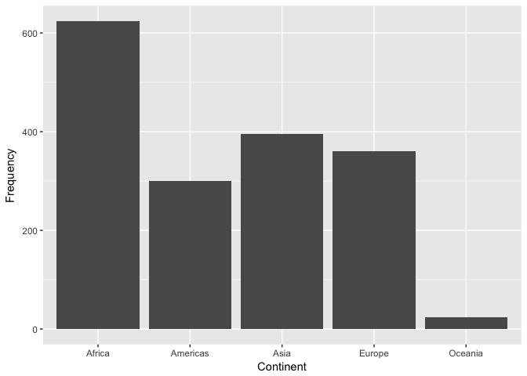
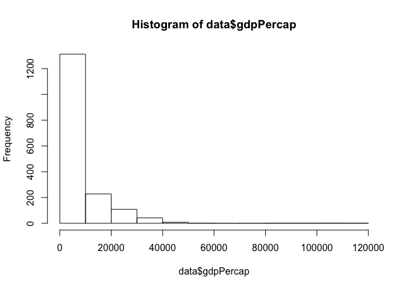
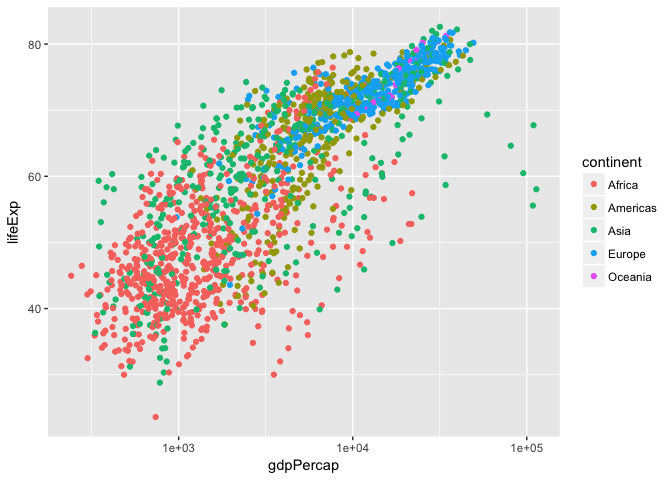
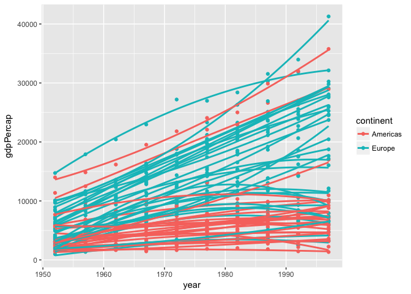
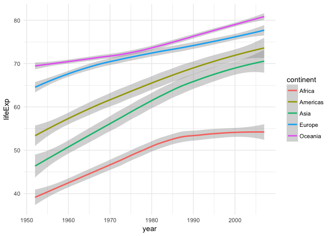
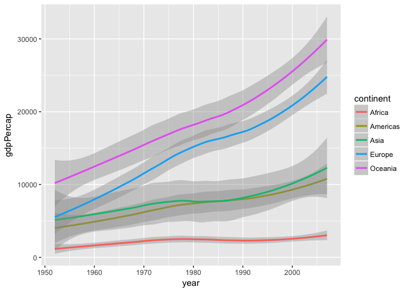
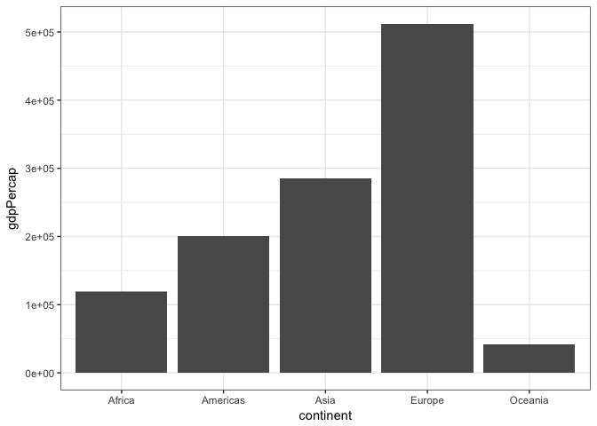

hw\_02\_gapminder\_dplyr
================
Cassandra
2017-09-26

Bring rectangular data in
=========================

-   Install and load required packages

``` r
library(gapminder)
library(tidyverse)
```

    ## Warning: package 'tidyverse' was built under R version 3.3.2

    ## Loading tidyverse: ggplot2
    ## Loading tidyverse: tibble
    ## Loading tidyverse: tidyr
    ## Loading tidyverse: readr
    ## Loading tidyverse: purrr
    ## Loading tidyverse: dplyr

    ## Warning: package 'ggplot2' was built under R version 3.3.2

    ## Warning: package 'tibble' was built under R version 3.3.2

    ## Warning: package 'tidyr' was built under R version 3.3.2

    ## Warning: package 'readr' was built under R version 3.3.2

    ## Warning: package 'purrr' was built under R version 3.3.2

    ## Warning: package 'dplyr' was built under R version 3.3.2

    ## Conflicts with tidy packages ----------------------------------------------

    ## filter(): dplyr, stats
    ## lag():    dplyr, stats

``` r
library(dplyr)
```

Smell test the data
===================

-   Is it a data.frame, a matrix, a vector, a list?

A data.frame is a list of vectors

``` r
data <- gapminder
typeof(data)
```

    ## [1] "list"

-   What’s its class?

The class of the data.frame is a table or "tibble".

``` r
class(data)
```

    ## [1] "tbl_df"     "tbl"        "data.frame"

-   How many variables/columns?

There are 6 variables/columns in the gapminder data set.

``` r
ncol(data)
```

    ## [1] 6

-   How many rows/observations?

There are 1704 rows/observations in the gapminder data set.

``` r
nrow(data)
```

    ## [1] 1704

-   Can you get these facts about “extent” or “size” in more than one way? Can you imagine different functions being useful in different contexts?

Get dimmensions of the data set using dim(). This would be good if we want a really quick overview of the size of the dataset

``` r
dim(data)
```

    ## [1] 1704    6

Get length of object - in this case the length of the list of vectors (rows). This would be useful if we only wanted to know the number of rows (similar function to the nrow() function)

``` r
length(data)
```

    ## [1] 6

Get the names of the columns - we can see that there are 6 in total. This is useful if we not only want the number of columns, but also their names.

``` r
names(data)
```

    ## [1] "country"   "continent" "year"      "lifeExp"   "pop"       "gdpPercap"

-   What data type is each variable?

Use the typeof() function to find the data type of each variable. We can use the column names given above ...

country:

``` r
typeof(data$country)
```

    ## [1] "integer"

continent:

``` r
typeof(data$continent)
```

    ## [1] "integer"

year:

``` r
typeof(data$year)
```

    ## [1] "integer"

lifeExp:

``` r
typeof(data$lifeExp)
```

    ## [1] "double"

pop:

``` r
typeof(data$pop)
```

    ## [1] "integer"

gdpPercap:

``` r
typeof(data$gdpPercap)
```

    ## [1] "double"

Explore individual variables
============================

-   Pick at least one categorical variable and at least one quantitative variable to explore. I chose to use the variables **"continent"** and **"gdpPercap"**
-   What are possible values (or range, whichever is appropriate) of each variable?
-   What values are typical? What’s the spread? What’s the distribution? Etc., tailored to the variable at hand. Feel free to use summary stats, tables, figures. We’re NOT expecting high production value (yet).

The possible values and frequency of each value for continent are shown in the summary output. In addition there is a plot with the frequency of each value of continent.

``` r
summary(data$continent)
```

    ##   Africa Americas     Asia   Europe  Oceania 
    ##      624      300      396      360       24

``` r
ggplot(data.frame(data$continent), aes(x=data$continent)) + xlab("Continent") + ylab("Frequency") +
  geom_bar()
```



The summary function shows that the minimum gdpPercap is 241.2 and the maximum is 113500.0. The mean is 7215.0. The histogram shows the distribution of values. Values under 10000 seem to be the most common.

``` r
summary(data$gdpPercap)
```

    ##     Min.  1st Qu.   Median     Mean  3rd Qu.     Max. 
    ##    241.2   1202.0   3532.0   7215.0   9325.0 113500.0

``` r
hist(data$gdpPercap)
```



Explore various plot types
==========================

A scatter plot of lifeExp as a function of gdpPercap. The points are coloured by continent and the x axis is a log scale for easier readability.

``` r
ggplot(gapminder, aes(gdpPercap, lifeExp, colour=continent)) + geom_point() + scale_x_log10()
```



Here I filtered the data to only get rows where the continent was either 'Americas' or 'Europe' and where the year was betwenn 1950 and 2000. I then selected columns from this filtered dataset and piped that data into ggplot. I then plotted gdpPercap by year and grouped the points by country. I then coloured the points by continent and added lines through the points using the geom\_smooth() line.

``` r
filter(gapminder,
       ((continent == "Americas") & year %in% 1950:2000)|
           ((continent == "Europe") & year %in% 1950:2000)) %>%
select(year, gdpPercap,country,continent) %>%
ggplot(aes(year, gdpPercap, group=country, colour=continent)) + geom_point() + geom_smooth(se=FALSE, method="loess", span=5)
```

    ## Warning: package 'bindrcpp' was built under R version 3.3.2



For the next two plots I decided to plot both gdpPercap and lifeExp by year. I grouped the data by continent and coloured the lines by continent as well.

``` r
ggplot(gapminder, aes(year, lifeExp, colour=continent)) + geom_smooth() +theme_minimal()
```

    ## `geom_smooth()` using method = 'loess'



``` r
ggplot(gapminder, aes(year, gdpPercap, colour=continent)) + geom_smooth() 
```

    ## `geom_smooth()` using method = 'loess'



Here Ic reated a bar graph of the gdpPercap for each continent, for the year 1992. I used filter, select, and piping once again to feed the data into ggplot.

``` r
filter(gapminder, year == 1992) %>%
select (country, continent, gdpPercap) %>%
ggplot(aes(continent, gdpPercap)) + geom_col() + theme_bw()
```



But I want to do more!
======================

``` r
filter(gapminder, country == c("Rwanda","Afghanistan"))
```

    ## # A tibble: 12 x 6
    ##        country continent  year lifeExp      pop gdpPercap
    ##         <fctr>    <fctr> <int>   <dbl>    <int>     <dbl>
    ##  1 Afghanistan      Asia  1957  30.332  9240934  820.8530
    ##  2 Afghanistan      Asia  1967  34.020 11537966  836.1971
    ##  3 Afghanistan      Asia  1977  38.438 14880372  786.1134
    ##  4 Afghanistan      Asia  1987  40.822 13867957  852.3959
    ##  5 Afghanistan      Asia  1997  41.763 22227415  635.3414
    ##  6 Afghanistan      Asia  2007  43.828 31889923  974.5803
    ##  7      Rwanda    Africa  1952  40.000  2534927  493.3239
    ##  8      Rwanda    Africa  1962  43.000  3051242  597.4731
    ##  9      Rwanda    Africa  1972  44.600  3992121  590.5807
    ## 10      Rwanda    Africa  1982  46.218  5507565  881.5706
    ## 11      Rwanda    Africa  1992  23.599  7290203  737.0686
    ## 12      Rwanda    Africa  2002  43.413  7852401  785.6538

Perhaps the first code filters through the dataset by comparing each row in the dataset to one item in the list. This would mean that everysecond row in the Afghanistan data, for example, would be compared to Rwanda and therefore it would be FALSE. The same would apply for Rwanda.

This could be re-written as the following:

``` r
filter(gapminder, country == "Rwanda" | country == "Afghanistan")
```

    ## # A tibble: 24 x 6
    ##        country continent  year lifeExp      pop gdpPercap
    ##         <fctr>    <fctr> <int>   <dbl>    <int>     <dbl>
    ##  1 Afghanistan      Asia  1952  28.801  8425333  779.4453
    ##  2 Afghanistan      Asia  1957  30.332  9240934  820.8530
    ##  3 Afghanistan      Asia  1962  31.997 10267083  853.1007
    ##  4 Afghanistan      Asia  1967  34.020 11537966  836.1971
    ##  5 Afghanistan      Asia  1972  36.088 13079460  739.9811
    ##  6 Afghanistan      Asia  1977  38.438 14880372  786.1134
    ##  7 Afghanistan      Asia  1982  39.854 12881816  978.0114
    ##  8 Afghanistan      Asia  1987  40.822 13867957  852.3959
    ##  9 Afghanistan      Asia  1992  41.674 16317921  649.3414
    ## 10 Afghanistan      Asia  1997  41.763 22227415  635.3414
    ## # ... with 14 more rows

This selects all rows where the country is equal to Afghanistan OR Rwanda as intended.

That is all of the 'more' that I would like to do!

Report your process
===================

-   Reflect on what was hard/easy It was difficult remembering some of the syntax for ggplot2 and some of the functions that we had used in class. I had to go back to the code from the excercises in order to remember the syntax. The data smelling was fairly straight forward.
-   problems you solved Most of the problems that I solved throughout the assignment were to do with having the right elements in the right place when creating the plots.
-   helpful tutorials you read: [Tutorial for bar graph](http://ggplot2.tidyverse.org/reference/geom_bar.html), [Tutorial for ggplot2 themes](https://stackoverflow.com/questions/10861773/remove-grid-background-color-and-top-and-right-borders-from-ggplot2)

-   What things were hard, even though you saw them in class? I found it hard to customize the plots the way that I wanted them to look and group the data by the proper variables.
-   What was easy(-ish) even though we haven’t done it in class? I found that it was easy to add additional layers on to the plots and change the theme.

Workflow:
=========

-   I edited my existing homework 01 repo and created sub-folders within it for each weeks homework. I also created a .README file for each new folder and described the contents on that page.
-   I edied the .README file for the hw-02 folder through RStudio using the project that I created last week
-   I made a new RMarkdown file for the homework 2 assignment and added content
-   I then used the recommended workflow of saving changes, pulling from GitHub, commiting changes, and then pushing to GitHub from my local machine
