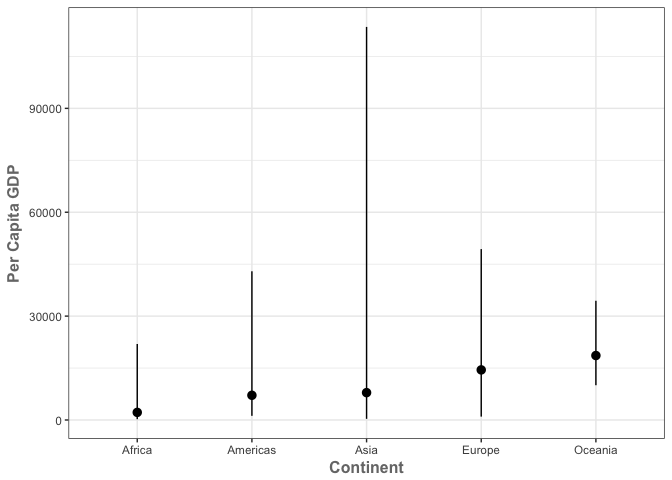
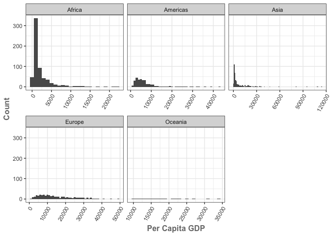
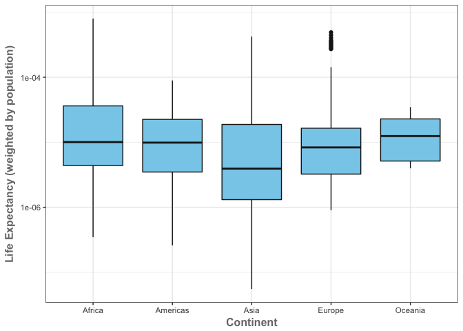
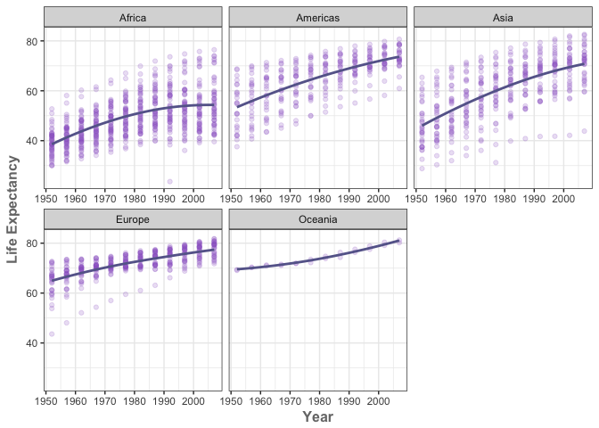
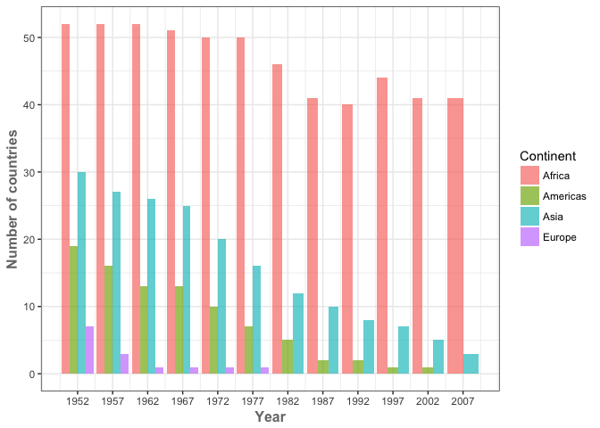
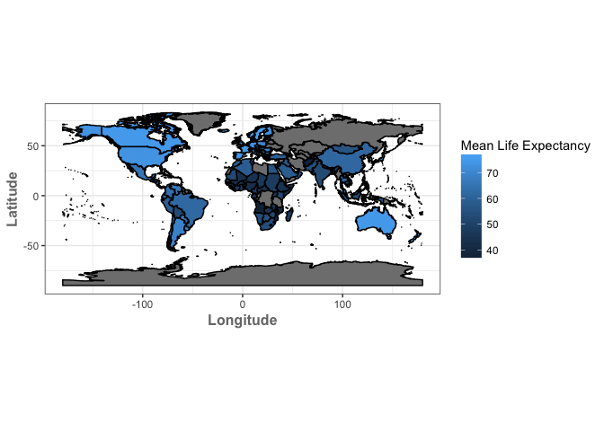

HW03
================
Cassandra
2017-10-01

<style type="text/css">
.twoC {width: 100%}
.clearer {clear: both}
.twoC .table {max-width: 50%; float: right; overflow-y:hidden}
.twoC img {max-width: 50%; float: left; overflow-y:hidden}
.oneC {width: 100%; inline-block}
</style>
Task menu
=========

Load Required packages
----------------------

``` r
suppressMessages(library(gapminder))
suppressMessages(library(dplyr))
```

    ## Warning: package 'dplyr' was built under R version 3.3.2

``` r
suppressMessages(library(ggplot2))
```

    ## Warning: package 'ggplot2' was built under R version 3.3.2

``` r
suppressMessages(library(rgdal))
```

    ## Warning: package 'rgdal' was built under R version 3.3.2

    ## Warning: package 'sp' was built under R version 3.3.2

``` r
suppressMessages(library(rgeos))
```

    ## Warning: package 'rgeos' was built under R version 3.3.2

``` r
suppressMessages(library(maptools))
```

    ## Warning: package 'maptools' was built under R version 3.3.2

``` r
suppressMessages(library(mapproj))
```

    ## Warning: package 'mapproj' was built under R version 3.3.2

    ## Warning: package 'maps' was built under R version 3.3.2

``` r
suppressMessages(library(reshape))
```

    ## Warning: package 'reshape' was built under R version 3.3.2

Get the maximum and minimum of GDP per capita for all continents.
-----------------------------------------------------------------

-   I used the summarize function to calculate the max and min GDP per capita for all of the continents in the gapminder dataset. I then used knitr to format the data into a table. I also mapped the data maximum, minimum, and mean in ggplot using [stat\_summary](http://ggplot2.tidyverse.org/reference/stat_summary.html).

``` r
gapminder %>%
    group_by(continent) %>% 
    summarize(max_gdpPercap = max(gdpPercap),
              min_gdpPercap = min(gdpPercap)) %>%
knitr::kable()
```

| continent |  max\_gdpPercap|  min\_gdpPercap|
|:----------|---------------:|---------------:|
| Africa    |        21951.21|        241.1659|
| Americas  |        42951.65|       1201.6372|
| Asia      |       113523.13|        331.0000|
| Europe    |        49357.19|        973.5332|
| Oceania   |        34435.37|      10039.5956|

``` r
gapminder %>%
    group_by(continent) %>% 
ggplot() + 
  stat_summary(
    mapping = aes(x = continent, y = gdpPercap),
    fun.ymin = min,
    fun.ymax = max,
    fun.y = mean)+
    theme_bw() +
    theme(axis.title = element_text(color="#777777", face="bold", size=12)) + 
    labs(y = 'Per Capita GDP', x = 'Continent') 
```



Look at the spread of GDP per capita within the continents.
-----------------------------------------------------------

-   I created a table to show the minimum, median, mean, variance, standard deviation, maximum and number of observations of GDP per capita for each continent. I also created a plot faceted by continent in order show the distribution of the data visually, seperated by continent. For the x-axis, I decided to use free\_x in order to allow the scale to vary by plot. Some continents have a larger range of data while others have a smaller range.

``` r
gapminder %>% 
group_by(continent) %>%
  summarise(Min = min(gdpPercap, na.rm=TRUE),
                     Median = median(gdpPercap, na.rm=TRUE),
                     Mean = mean(gdpPercap, na.rm=TRUE),
                     Var = var(gdpPercap, na.rm=TRUE),
                     SD = sd(gdpPercap, na.rm=TRUE),
                     Max = max(gdpPercap, na.rm=TRUE),
                     N = n()) %>%
knitr::kable()
```

    ## Warning: package 'bindrcpp' was built under R version 3.3.2

| continent |         Min|     Median|       Mean|        Var|         SD|        Max|    N|
|:----------|-----------:|----------:|----------:|----------:|----------:|----------:|----:|
| Africa    |    241.1659|   1192.138|   2193.755|    7997187|   2827.930|   21951.21|  624|
| Americas  |   1201.6372|   5465.510|   7136.110|   40918591|   6396.764|   42951.65|  300|
| Asia      |    331.0000|   2646.787|   7902.150|  197272506|  14045.373|  113523.13|  396|
| Europe    |    973.5332|  12081.749|  14469.476|   87520020|   9355.213|   49357.19|  360|
| Oceania   |  10039.5956|  17983.304|  18621.609|   40436669|   6358.983|   34435.37|   24|

``` r
gapminder %>%
ggplot(aes(gdpPercap)) + 
  facet_wrap(~ continent,scales="free_x") + 
  geom_histogram(binwidth=1000) +
  labs(x = 'Per Capita GDP', y = 'Count') +
  theme_bw() +
  theme(axis.title = element_text(color="#777777", face="bold", size=12)) +
  theme(axis.text.x = element_text(angle = 60, hjust = 1))
```



Compute a trimmed mean of life expectancy for different years. Or a weighted mean, weighting by population. Just try something other than the plain vanilla mean.
-----------------------------------------------------------------------------------------------------------------------------------------------------------------

-   I decided to compute the mean life expectancy weighted by population for each continent. This weighted mean is presented in a table. In addition I included a box plot where the life expectancy weighted by population for each country is plotted by continent. The mean is shown for each continent.

``` r
gapminder %>%
group_by(continent) %>% 
summarize(mean_lifeExp = mean(lifeExp/pop)) %>%
knitr::kable()
```

| continent |  mean\_lifeExp|
|:----------|--------------:|
| Africa    |       4.24e-05|
| Americas  |       1.53e-05|
| Asia      |       1.99e-05|
| Europe    |       2.57e-05|
| Oceania   |       1.51e-05|

``` r
gapminder %>%
mutate(lifeExp_pop = (lifeExp/pop)) %>%
ggplot(aes(x=continent, y=lifeExp_pop)) + geom_boxplot(colour="gray10", fill="skyblue") +
scale_y_log10() +  labs(x = 'Continent', y = 'Life Expectancy (weighted by population)') +
theme_bw() +
theme(axis.title = element_text(color="#777777", face="bold", size=12))
```



How is life expectancy changing over time on different continents?
------------------------------------------------------------------

-   I used the summarise function to calculate the mean life expectancy by continent for each year. I then used [cast](https://www.r-statistics.com/2012/01/aggregation-and-restructuring-data-from-r-in-action/) in order to reformat the table in a way that was easier to ready. I also plotted the life expectancy for each country through time faceted by continent. I then added a trend line in order to see the trend of life expectancy through time for each continent.

``` r
gapminder %>%
group_by(continent, year) %>%
summarise(mean_lifeExp=mean(lifeExp)) %>%
cast(continent~year) %>%
knitr::kable()
```

    ## Using mean_lifeExp as value column.  Use the value argument to cast to override this choice

| continent |      1952|      1957|      1962|      1967|      1972|      1977|      1982|      1987|      1992|      1997|      2002|      2007|
|:----------|---------:|---------:|---------:|---------:|---------:|---------:|---------:|---------:|---------:|---------:|---------:|---------:|
| Africa    |  39.13550|  41.26635|  43.31944|  45.33454|  47.45094|  49.58042|  51.59287|  53.34479|  53.62958|  53.59827|  53.32523|  54.80604|
| Americas  |  53.27984|  55.96028|  58.39876|  60.41092|  62.39492|  64.39156|  66.22884|  68.09072|  69.56836|  71.15048|  72.42204|  73.60812|
| Asia      |  46.31439|  49.31854|  51.56322|  54.66364|  57.31927|  59.61056|  62.61794|  64.85118|  66.53721|  68.02052|  69.23388|  70.72848|
| Europe    |  64.40850|  66.70307|  68.53923|  69.73760|  70.77503|  71.93777|  72.80640|  73.64217|  74.44010|  75.50517|  76.70060|  77.64860|
| Oceania   |  69.25500|  70.29500|  71.08500|  71.31000|  71.91000|  72.85500|  74.29000|  75.32000|  76.94500|  78.19000|  79.74000|  80.71950|

``` r
ggplot(gapminder, aes(year, lifeExp)) +
    labs(x = 'Year', y = 'Life Expectancy') +
    facet_wrap(~ continent,scales="free_x") +
    geom_point(colour="#9966CC", alpha=0.2) + geom_smooth(span=2, colour="#666699", se=FALSE)+
    theme_bw() +
    theme(axis.title = element_text(color="#777777", face="bold", size=12))
```

    ## `geom_smooth()` using method = 'loess'



Report the absolute and/or relative abundance of countries with low life expectancy over time by continent: Compute some measure of worldwide life expectancy – you decide – a mean or median or some other quantile or perhaps your current age. Then determine how many countries on each continent have a life expectancy less than this benchmark, for each year.
---------------------------------------------------------------------------------------------------------------------------------------------------------------------------------------------------------------------------------------------------------------------------------------------------------------------------------------------------------------------

-   I computed the median life expectancy for the entire gapminder dataset. I then used tally() to determine how many countries from each continent fall below this benchmark each year. This is shown in the format of a table. I used cast once again in order to reformat the table with time on the top row of the table. I also greated a bar graph that shows the number of countries below the benchmark in each continent through time.

``` r
gapminder %>%
filter(lifeExp<(median(gapminder$lifeExp))) %>%
group_by(year, continent) %>%
tally() %>%
cast(continent~year) %>%
knitr::kable()
```

    ## Using n as value column.  Use the value argument to cast to override this choice

| continent |  1952|  1957|  1962|  1967|  1972|  1977|  1982|  1987|  1992|  1997|  2002|  2007|
|:----------|-----:|-----:|-----:|-----:|-----:|-----:|-----:|-----:|-----:|-----:|-----:|-----:|
| Africa    |    52|    52|    52|    51|    50|    50|    46|    41|    40|    44|    41|    41|
| Americas  |    19|    16|    13|    13|    10|     7|     5|     2|     2|     1|     1|    NA|
| Asia      |    30|    27|    26|    25|    20|    16|    12|    10|     8|     7|     5|     3|
| Europe    |     7|     3|     1|     1|     1|     1|    NA|    NA|    NA|    NA|    NA|    NA|

``` r
gapminder %>%
filter(lifeExp<(median(gapminder$lifeExp))) %>%
group_by(year, continent) %>%
tally() %>%
ggplot(aes(x = year, y = n, fill = continent)) + 
  geom_bar(stat = 'identity', position = 'dodge', alpha = 2/3) +
  labs(x = 'Year', y = 'Number of countries', fill = 'Continent') +
  theme_bw() +
  theme(axis.title = element_text(color="#777777", face="bold", size=12)) +
  scale_x_continuous(breaks=c(1952,1957,1962,1967,1972,1977,1982,1987,1992,1997,2002,2007))
```



-   I decided that I would give [mapping](http://rpsychologist.com/working-with-shapefiles-projections-and-world-maps-in-ggplot) a go in ggplot2 and try to map the mean life expectancy for each country on a world map. This turned out to be quite the endeavour but I learned a lot along the way! I got the world shape file from [here](http://thematicmapping.org/downloads). I then joined the spatial data table with the gapminder dataset and filled the polygons based on the calculated mean life expectancy. I played around with some different map projections and didn't really find one that was good at this scale (there seem to be some known glitches).

``` r
mle <- gapminder %>%
  group_by(country) %>%
  summarize(MeanLifeExpectancy=mean(lifeExp))
knitr::kable(mle)
```

| country                  |  MeanLifeExpectancy|
|:-------------------------|-------------------:|
| Afghanistan              |            37.47883|
| Albania                  |            68.43292|
| Algeria                  |            59.03017|
| Angola                   |            37.88350|
| Argentina                |            69.06042|
| Australia                |            74.66292|
| Austria                  |            73.10325|
| Bahrain                  |            65.60567|
| Bangladesh               |            49.83408|
| Belgium                  |            73.64175|
| Benin                    |            48.77992|
| Bolivia                  |            52.50458|
| Bosnia and Herzegovina   |            67.70783|
| Botswana                 |            54.59750|
| Brazil                   |            62.23950|
| Bulgaria                 |            69.74375|
| Burkina Faso             |            44.69400|
| Burundi                  |            44.81733|
| Cambodia                 |            47.90275|
| Cameroon                 |            48.12850|
| Canada                   |            74.90275|
| Central African Republic |            43.86692|
| Chad                     |            46.77358|
| Chile                    |            67.43092|
| China                    |            61.78514|
| Colombia                 |            63.89775|
| Comoros                  |            52.38175|
| Congo, Dem. Rep.         |            44.54375|
| Congo, Rep.              |            52.50192|
| Costa Rica               |            70.18142|
| Cote d'Ivoire            |            48.43617|
| Croatia                  |            70.05592|
| Cuba                     |            71.04508|
| Czech Republic           |            71.51050|
| Denmark                  |            74.37017|
| Djibouti                 |            46.38075|
| Dominican Republic       |            61.55450|
| Ecuador                  |            62.81683|
| Egypt                    |            56.24300|
| El Salvador              |            59.63333|
| Equatorial Guinea        |            42.96000|
| Eritrea                  |            45.99925|
| Ethiopia                 |            44.47575|
| Finland                  |            72.99192|
| France                   |            74.34892|
| Gabon                    |            51.22050|
| Gambia                   |            44.40058|
| Germany                  |            73.44442|
| Ghana                    |            52.34067|
| Greece                   |            73.73317|
| Guatemala                |            56.72942|
| Guinea                   |            43.23983|
| Guinea-Bissau            |            39.21025|
| Haiti                    |            50.16525|
| Honduras                 |            57.92083|
| Hong Kong, China         |            73.49283|
| Hungary                  |            69.39317|
| Iceland                  |            76.51142|
| India                    |            53.16608|
| Indonesia                |            54.33575|
| Iran                     |            58.63658|
| Iraq                     |            56.58175|
| Ireland                  |            73.01725|
| Israel                   |            73.64583|
| Italy                    |            74.01383|
| Jamaica                  |            68.74933|
| Japan                    |            74.82692|
| Jordan                   |            59.78642|
| Kenya                    |            52.68100|
| Korea, Dem. Rep.         |            63.60733|
| Korea, Rep.              |            65.00100|
| Kuwait                   |            68.92233|
| Lebanon                  |            65.86567|
| Lesotho                  |            50.00708|
| Liberia                  |            42.47625|
| Libya                    |            59.30417|
| Madagascar               |            47.77058|
| Malawi                   |            43.35158|
| Malaysia                 |            64.27958|
| Mali                     |            43.41350|
| Mauritania               |            52.30208|
| Mauritius                |            64.95325|
| Mexico                   |            65.40883|
| Mongolia                 |            55.89033|
| Montenegro               |            70.29917|
| Morocco                  |            57.60883|
| Mozambique               |            40.37950|
| Myanmar                  |            53.32167|
| Namibia                  |            53.49133|
| Nepal                    |            48.98633|
| Netherlands              |            75.64850|
| New Zealand              |            73.98950|
| Nicaragua                |            58.34942|
| Niger                    |            44.55867|
| Nigeria                  |            43.58133|
| Norway                   |            75.84300|
| Oman                     |            58.44267|
| Pakistan                 |            54.88225|
| Panama                   |            67.80175|
| Paraguay                 |            66.80908|
| Peru                     |            58.85933|
| Philippines              |            60.96725|
| Poland                   |            70.17692|
| Portugal                 |            70.41983|
| Puerto Rico              |            72.73933|
| Reunion                  |            66.64425|
| Romania                  |            68.29067|
| Rwanda                   |            41.48158|
| Sao Tome and Principe    |            57.89633|
| Saudi Arabia             |            58.67875|
| Senegal                  |            50.62592|
| Serbia                   |            68.55100|
| Sierra Leone             |            36.76917|
| Singapore                |            71.22025|
| Slovak Republic          |            70.69608|
| Slovenia                 |            71.60075|
| Somalia                  |            40.98867|
| South Africa             |            53.99317|
| Spain                    |            74.20342|
| Sri Lanka                |            66.52608|
| Sudan                    |            48.40050|
| Swaziland                |            49.00242|
| Sweden                   |            76.17700|
| Switzerland              |            75.56508|
| Syria                    |            61.34617|
| Taiwan                   |            70.33667|
| Tanzania                 |            47.91233|
| Thailand                 |            62.20025|
| Togo                     |            51.49875|
| Trinidad and Tobago      |            66.82800|
| Tunisia                  |            60.72100|
| Turkey                   |            59.69642|
| Uganda                   |            47.61883|
| United Kingdom           |            73.92258|
| United States            |            73.47850|
| Uruguay                  |            70.78158|
| Venezuela                |            66.58067|
| Vietnam                  |            57.47950|
| West Bank and Gaza       |            60.32867|
| Yemen, Rep.              |            46.78042|
| Zambia                   |            45.99633|
| Zimbabwe                 |            52.66317|

``` r
gde_15 <- readOGR("/Users/cassandrakonecny/Desktop/TM_WORLD_BORDERS-0.3", layer = "TM_WORLD_BORDERS-0.3")
```

OGR data source with driver: ESRI Shapefile Source: "/Users/cassandrakonecny/Desktop/TM\_WORLD\_BORDERS-0.3", layer: "TM\_WORLD\_BORDERS-0.3" with 246 features It has 11 fields Integer64 fields read as strings: POP2005

``` r
gde.df <- fortify(gde_15, region="NAME")
plotData <- merge(gde.df, mle, by.x = "id", by.y = "country", all = TRUE)
plotData<-plotData[order(plotData$order), ] 
ggplot() + geom_polygon(data=plotData, aes(x=long, y=lat, group=group, fill=MeanLifeExpectancy),colour='black') +
        labs(x = 'Longitude', y = 'Latitude', fill = 'Mean Life Expectancy') +
        theme_bw() + coord_equal() +
        theme(axis.title = element_text(color="#777777", face="bold", size=12))
```



Report your process
===================

-   I created the rmd file on my computer locally (in RStudio) and then committed changes/pushed to GitHub. I also made some edits on GitHub such as to the README file.
-   I found that the hardest part of this assignment was actually the work that I created for myself by figuring out how to create the make in ggplot. I spent most of the time trying to figure out how it was using the data and what format the joined tables had to be in.
-   Another difficult part for me was deciding what to customize and how much to customize on the plots. I find that this process can be endless and so it was important to prioritize what I wanted to modify/change.
-   It also took me a while to figure out that I could use cast to reformat the tables in the format that I wanted them.
-   I tried to figure out how to get the two columns to work but I gave up as I couldn't trouble shoot the CSS properly. Essentially I could get two columns but the formatting was very ugly and difficult to read. I tried multiple tags to the stylesheet to have some of it formatted as one column and some as two columns and adding different div tags throughout but this didnt work. I therefore decided to leave some of it in my work (in hope of feedback to solve my problems)!
-   It definitely was easier this time through to remember the dplyr and ggplot syntax and how to change attributes on the plots!
