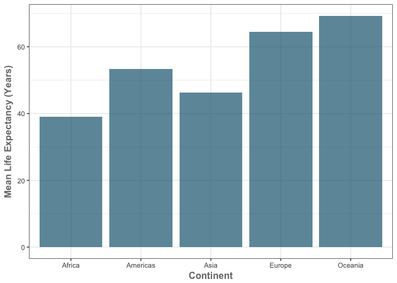

HW-04
================
Cassandra
2017-10-10

Load Required packages
----------------------

``` r
suppressMessages(library(gapminder))
suppressMessages(library(dplyr))
```

    ## Warning: package 'dplyr' was built under R version 3.3.2

``` r
suppressMessages(library(ggplot2))
```

    ## Warning: package 'ggplot2' was built under R version 3.3.2

``` r
suppressMessages(library(tidyr))
```

    ## Warning: package 'tidyr' was built under R version 3.3.2

``` r
suppressMessages(library(reshape))
```

    ## Warning: package 'reshape' was built under R version 3.3.2

``` r
suppressMessages(library(weatherData))
```

    ## Warning: package 'weatherData' was built under R version 3.3.2

``` r
suppressMessages(library(wbstats))
```

    ## Warning: package 'wbstats' was built under R version 3.3.2

General data reshaping and relationship to aggregation
======================================================

**Problem:** You have data in one “shape” but you wish it were in another. Usually this is because the alternative shape is superior for presenting a table, making a figure, or doing aggregation and statistical analysis.

**Solution:** Reshape your data. For simple reshaping, gather() and spread() from tidyr will suffice. Do the thing that it possible / easier now that your data has a new shape.

**Activity 3** Compute some measure of life expectancy (mean? median? min? max?) for all possible combinations of continent and year. Reshape that to have one row per year and one variable for each continent. Or the other way around: one row per continent and one variable per year. Use knitr::kable() to make these tables look pretty in your rendered homework. Is there a plot that is easier to make with the data in this shape versis the usual form? If so (or you think so), try it! Reflect.

-   For this activity I chose to compute the mean life expectancy by continent. I did this using a summarise function and calculating the mean. I then decided to use two different methods to reshape the data. First I used 'cast' from the Reshape2 package. Second I used spread from the tidyr package. As it turns out they work essentially the same way and really only have minor differences in their syntax (seperated by ',' vs '~').

This table was created using cast():

``` r
gapminder %>%
group_by(continent, year) %>%
summarise(mean_lifeExp=mean(lifeExp)) %>%
cast(continent~year) %>%
knitr::kable()
```

    ## Using mean_lifeExp as value column.  Use the value argument to cast to override this choice

| continent |      1952|      1957|      1962|      1967|      1972|      1977|      1982|      1987|      1992|      1997|      2002|      2007|
|:----------|---------:|---------:|---------:|---------:|---------:|---------:|---------:|---------:|---------:|---------:|---------:|---------:|
| Africa    |  39.13550|  41.26635|  43.31944|  45.33454|  47.45094|  49.58042|  51.59287|  53.34479|  53.62958|  53.59827|  53.32523|  54.80604|
| Americas  |  53.27984|  55.96028|  58.39876|  60.41092|  62.39492|  64.39156|  66.22884|  68.09072|  69.56836|  71.15048|  72.42204|  73.60812|
| Asia      |  46.31439|  49.31854|  51.56322|  54.66364|  57.31927|  59.61056|  62.61794|  64.85118|  66.53721|  68.02052|  69.23388|  70.72848|
| Europe    |  64.40850|  66.70307|  68.53923|  69.73760|  70.77503|  71.93777|  72.80640|  73.64217|  74.44010|  75.50517|  76.70060|  77.64860|
| Oceania   |  69.25500|  70.29500|  71.08500|  71.31000|  71.91000|  72.85500|  74.29000|  75.32000|  76.94500|  78.19000|  79.74000|  80.71950|

This table was created using spread():

``` r
gapminder %>%
group_by(continent, year) %>%
summarise(mean_lifeExp=mean(lifeExp)) %>%
spread(year, mean_lifeExp) %>%
knitr::kable()
```

| continent |      1952|      1957|      1962|      1967|      1972|      1977|      1982|      1987|      1992|      1997|      2002|      2007|
|:----------|---------:|---------:|---------:|---------:|---------:|---------:|---------:|---------:|---------:|---------:|---------:|---------:|
| Africa    |  39.13550|  41.26635|  43.31944|  45.33454|  47.45094|  49.58042|  51.59287|  53.34479|  53.62958|  53.59827|  53.32523|  54.80604|
| Americas  |  53.27984|  55.96028|  58.39876|  60.41092|  62.39492|  64.39156|  66.22884|  68.09072|  69.56836|  71.15048|  72.42204|  73.60812|
| Asia      |  46.31439|  49.31854|  51.56322|  54.66364|  57.31927|  59.61056|  62.61794|  64.85118|  66.53721|  68.02052|  69.23388|  70.72848|
| Europe    |  64.40850|  66.70307|  68.53923|  69.73760|  70.77503|  71.93777|  72.80640|  73.64217|  74.44010|  75.50517|  76.70060|  77.64860|
| Oceania   |  69.25500|  70.29500|  71.08500|  71.31000|  71.91000|  72.85500|  74.29000|  75.32000|  76.94500|  78.19000|  79.74000|  80.71950|

I then tried to think of ways that I could plot this data ... and was it ever hard! Why would you want the data this way?! But I tried anyways and here is what I came up with ... So let's say that hypothetically you wanted to make a bar graph of the life expectancy for just one year. You could use the data in this format and plot one of the year columns (1952 in this case) for each continent in a bar graph. You could also just filter the data by year however and obtain the same result as I demonstrated. It ultimately ends up being the same number of lines of code. So as I reflect I think that in this example the reshaped data may only make interpreting the data easier in the format of a table but does not make it easier to plot necessarily.

-   This Bar graph was created by reshaping the data:

``` r
gapminder %>%
group_by(continent, year) %>%
summarise(mean_lifeExp=mean(lifeExp)) %>%
spread(year, mean_lifeExp) %>%
ggplot(aes(continent, `1952`)) +
    labs(x = 'Continent', y = 'Mean Life Expectancy (Years)') +
    geom_bar(fill=rgb(0.1,0.4,0.5,0.7), stat="identity") +
    theme_bw()+
    theme(axis.title = element_text(color="#777777", face="bold", size=12))
```



-   This Bar graph was created by filtering the data:

``` r
gapminder %>%
filter(year==1952) %>%
group_by(continent) %>%
summarise(mean_lifeExp=mean(lifeExp)) %>%
ggplot(aes(continent, mean_lifeExp)) +
    labs(x = 'Continent', y = 'Mean Life Expectancy (Years)') +
    geom_bar(fill=rgb(0.1,0.4,0.5,0.7), stat="identity") +
    theme_bw()+
    theme(axis.title = element_text(color="#777777", face="bold", size=12))
```

    ## Warning: package 'bindrcpp' was built under R version 3.3.2


I bet that if I set ECHO to False you wouldnt be able to tell the difference! Moving on ...

Join, merge, look up
====================

**Problem:** You have two data sources and you need info from both in one new data object.

**Solution:** Perform a join, which borrows terminology from the database world, specifically SQL.

**Activity 1**

Create a second data frame, complementary to Gapminder. Join this with (part of) Gapminder using a dplyr join function and make some observations about the process and result. Explore the different types of joins. Examples of a second data frame you could build:

-   One row per country, a country variable and one or more variables with extra info, such as language spoken, NATO membership, national animal, or capitol city. If you really want to be helpful, you could attempt to make a pull request to resolve this issue, where I would like to bring ISO country codes into the gapminder package.

-   One row per continent, a continent variable and one or more variables with extra info, such as northern versus southern hemisphere.

I decided to use a subset of both the the wbcountries data set and the gapminder data set to answer this question. I used only the first 15 rows of the wbcountries dataset and the first 10 of the gapminder dataset in order to present the results in reasonably sized tables. In all cases the tables are joined by the country column.

``` r
wb_subset <- (data.frame(wbcountries()) %>%
select(country, capital, lat, long))[c(1:15),]

gapminder_subset <- (gapminder %>%
  filter(year==2002))[c(1:10),]
```

I started by looking at inner\_join between data frames. The first table has the world bank data as the X table and the gapminder data as the Y table. As we can see this returns all of the rows from wb\_subset where the country is also found in gapminder\_subset, and all of the columns from wb\_subset and gapminder\_subset.

The second table has the gapminder data as the X table and the world bank data as the Y table.As we can see this returns all of the rows from gapminder\_subset where the country is also found in wb\_subset, and all of the columns from wb\_subset and gapminder\_subset and all of the columns from gapminder\_subset and wb\_subset.

I then used the merge function which essentially performs the same as an inner\_join and has the same syntax. This data is presented in tables three and four.

Amazingly enough - all of the tables have the same rows of data. This makes sense as they both present all of the countries that are common in both tables. The only differences are the order of columns which is dependant on which data frame is listed first in the function.

``` r
inner_join(wb_subset,gapminder_subset) %>%
knitr::kable()
```

    ## Joining, by = "country"

    ## Warning: Column `country` joining character vector and factor, coercing
    ## into character vector

| country     | capital      | lat      | long     | continent |  year|  lifeExp|       pop|   gdpPercap|
|:------------|:-------------|:---------|:---------|:----------|-----:|--------:|---------:|-----------:|
| Afghanistan | Kabul        | 34.5228  | 69.1761  | Asia      |  2002|   42.129|  25268405|    726.7341|
| Angola      | Luanda       | -8.81155 | 13.242   | Africa    |  2002|   41.003|  10866106|   2773.2873|
| Albania     | Tirane       | 41.3317  | 19.8172  | Europe    |  2002|   75.651|   3508512|   4604.2117|
| Argentina   | Buenos Aires | -34.6118 | -58.4173 | Americas  |  2002|   74.340|  38331121|   8797.6407|
| Australia   | Canberra     | -35.282  | 149.129  | Oceania   |  2002|   80.370|  19546792|  30687.7547|
| Austria     | Vienna       | 48.2201  | 16.3798  | Europe    |  2002|   78.980|   8148312|  32417.6077|

``` r
inner_join(gapminder_subset,wb_subset) %>%
knitr::kable()
```

    ## Joining, by = "country"

    ## Warning: Column `country` joining factor and character vector, coercing
    ## into character vector

| country     | continent |  year|  lifeExp|       pop|   gdpPercap| capital      | lat      | long     |
|:------------|:----------|-----:|--------:|---------:|-----------:|:-------------|:---------|:---------|
| Afghanistan | Asia      |  2002|   42.129|  25268405|    726.7341| Kabul        | 34.5228  | 69.1761  |
| Albania     | Europe    |  2002|   75.651|   3508512|   4604.2117| Tirane       | 41.3317  | 19.8172  |
| Angola      | Africa    |  2002|   41.003|  10866106|   2773.2873| Luanda       | -8.81155 | 13.242   |
| Argentina   | Americas  |  2002|   74.340|  38331121|   8797.6407| Buenos Aires | -34.6118 | -58.4173 |
| Australia   | Oceania   |  2002|   80.370|  19546792|  30687.7547| Canberra     | -35.282  | 149.129  |
| Austria     | Europe    |  2002|   78.980|   8148312|  32417.6077| Vienna       | 48.2201  | 16.3798  |

``` r
merge(wb_subset, gapminder_subset) %>%
knitr::kable()
```

| country     | capital      | lat      | long     | continent |  year|  lifeExp|       pop|   gdpPercap|
|:------------|:-------------|:---------|:---------|:----------|-----:|--------:|---------:|-----------:|
| Afghanistan | Kabul        | 34.5228  | 69.1761  | Asia      |  2002|   42.129|  25268405|    726.7341|
| Albania     | Tirane       | 41.3317  | 19.8172  | Europe    |  2002|   75.651|   3508512|   4604.2117|
| Angola      | Luanda       | -8.81155 | 13.242   | Africa    |  2002|   41.003|  10866106|   2773.2873|
| Argentina   | Buenos Aires | -34.6118 | -58.4173 | Americas  |  2002|   74.340|  38331121|   8797.6407|
| Australia   | Canberra     | -35.282  | 149.129  | Oceania   |  2002|   80.370|  19546792|  30687.7547|
| Austria     | Vienna       | 48.2201  | 16.3798  | Europe    |  2002|   78.980|   8148312|  32417.6077|

``` r
merge(gapminder_subset,wb_subset) %>%
knitr::kable()
```

| country     | continent |  year|  lifeExp|       pop|   gdpPercap| capital      | lat      | long     |
|:------------|:----------|-----:|--------:|---------:|-----------:|:-------------|:---------|:---------|
| Afghanistan | Asia      |  2002|   42.129|  25268405|    726.7341| Kabul        | 34.5228  | 69.1761  |
| Albania     | Europe    |  2002|   75.651|   3508512|   4604.2117| Tirane       | 41.3317  | 19.8172  |
| Angola      | Africa    |  2002|   41.003|  10866106|   2773.2873| Luanda       | -8.81155 | 13.242   |
| Argentina   | Americas  |  2002|   74.340|  38331121|   8797.6407| Buenos Aires | -34.6118 | -58.4173 |
| Australia   | Oceania   |  2002|   80.370|  19546792|  30687.7547| Canberra     | -35.282  | 149.129  |
| Austria     | Europe    |  2002|   78.980|   8148312|  32417.6077| Vienna       | 48.2201  | 16.3798  |

The next join that I looked at was semi\_join. With the semi join we can see that regardless of which table is X and which is Y, we get the same countries as with the inner\_join. This is because all countries that are present in both tables are shown once again. The difference here is that only columns from table X are kept. As you can see in the first table where the wb\_subset data frame is X, only the columns from that data frame are returned. Likewise when the gapminder data frame is X in the second table, only the columns from that data frame are returned.

``` r
semi_join(wb_subset,gapminder_subset) %>%
knitr::kable()
```

    ## Joining, by = "country"

    ## Warning: Column `country` joining character vector and factor, coercing
    ## into character vector

| country     | capital      | lat      | long     |
|:------------|:-------------|:---------|:---------|
| Afghanistan | Kabul        | 34.5228  | 69.1761  |
| Albania     | Tirane       | 41.3317  | 19.8172  |
| Angola      | Luanda       | -8.81155 | 13.242   |
| Argentina   | Buenos Aires | -34.6118 | -58.4173 |
| Australia   | Canberra     | -35.282  | 149.129  |
| Austria     | Vienna       | 48.2201  | 16.3798  |

``` r
semi_join(gapminder_subset,wb_subset) %>%
knitr::kable()
```

    ## Joining, by = "country"

    ## Warning: Column `country` joining factor and character vector, coercing
    ## into character vector

| country     | continent |  year|  lifeExp|       pop|   gdpPercap|
|:------------|:----------|-----:|--------:|---------:|-----------:|
| Afghanistan | Asia      |  2002|   42.129|  25268405|    726.7341|
| Angola      | Africa    |  2002|   41.003|  10866106|   2773.2873|
| Albania     | Europe    |  2002|   75.651|   3508512|   4604.2117|
| Argentina   | Americas  |  2002|   74.340|  38331121|   8797.6407|
| Australia   | Oceania   |  2002|   80.370|  19546792|  30687.7547|
| Austria     | Europe    |  2002|   78.980|   8148312|  32417.6077|

Moving forward we have the left\_join! This is where we get into the NAs! In the first table (wb\_subet = X, gapminder\_subset = Y) we see that all rows from wb\_subset are returned and all of the columns from both datasets. Similarly in the second table (gapminder\_subet = X, wb\_subset = Y) we see that all rows from gapminder\_subset are returned and all of the columns from both datasets. We get NA values anywhere where there is no data for a country in those columns resulting from the left join.

``` r
left_join(wb_subset,gapminder_subset) %>%
knitr::kable()
```

    ## Joining, by = "country"

    ## Warning: Column `country` joining character vector and factor, coercing
    ## into character vector

| country              | capital          | lat      | long     | continent |  year|  lifeExp|       pop|   gdpPercap|
|:---------------------|:-----------------|:---------|:---------|:----------|-----:|--------:|---------:|-----------:|
| Aruba                | Oranjestad       | 12.5167  | -70.0167 | NA        |    NA|       NA|        NA|          NA|
| Afghanistan          | Kabul            | 34.5228  | 69.1761  | Asia      |  2002|   42.129|  25268405|    726.7341|
| Africa               | NA               | NA       | NA       | NA        |    NA|       NA|        NA|          NA|
| Angola               | Luanda           | -8.81155 | 13.242   | Africa    |  2002|   41.003|  10866106|   2773.2873|
| Albania              | Tirane           | 41.3317  | 19.8172  | Europe    |  2002|   75.651|   3508512|   4604.2117|
| Andorra              | Andorra la Vella | 42.5075  | 1.5218   | NA        |    NA|       NA|        NA|          NA|
| Andean Region        | NA               | NA       | NA       | NA        |    NA|       NA|        NA|          NA|
| Arab World           | NA               | NA       | NA       | NA        |    NA|       NA|        NA|          NA|
| United Arab Emirates | Abu Dhabi        | 24.4764  | 54.3705  | NA        |    NA|       NA|        NA|          NA|
| Argentina            | Buenos Aires     | -34.6118 | -58.4173 | Americas  |  2002|   74.340|  38331121|   8797.6407|
| Armenia              | Yerevan          | 40.1596  | 44.509   | NA        |    NA|       NA|        NA|          NA|
| American Samoa       | Pago Pago        | -14.2846 | -170.691 | NA        |    NA|       NA|        NA|          NA|
| Antigua and Barbuda  | Saint John's     | 17.1175  | -61.8456 | NA        |    NA|       NA|        NA|          NA|
| Australia            | Canberra         | -35.282  | 149.129  | Oceania   |  2002|   80.370|  19546792|  30687.7547|
| Austria              | Vienna           | 48.2201  | 16.3798  | Europe    |  2002|   78.980|   8148312|  32417.6077|

``` r
left_join(gapminder_subset,wb_subset) %>%
knitr::kable()
```

    ## Joining, by = "country"

    ## Warning: Column `country` joining factor and character vector, coercing
    ## into character vector

| country     | continent |  year|  lifeExp|        pop|   gdpPercap| capital      | lat      | long     |
|:------------|:----------|-----:|--------:|----------:|-----------:|:-------------|:---------|:---------|
| Afghanistan | Asia      |  2002|   42.129|   25268405|    726.7341| Kabul        | 34.5228  | 69.1761  |
| Albania     | Europe    |  2002|   75.651|    3508512|   4604.2117| Tirane       | 41.3317  | 19.8172  |
| Algeria     | Africa    |  2002|   70.994|   31287142|   5288.0404| NA           | NA       | NA       |
| Angola      | Africa    |  2002|   41.003|   10866106|   2773.2873| Luanda       | -8.81155 | 13.242   |
| Argentina   | Americas  |  2002|   74.340|   38331121|   8797.6407| Buenos Aires | -34.6118 | -58.4173 |
| Australia   | Oceania   |  2002|   80.370|   19546792|  30687.7547| Canberra     | -35.282  | 149.129  |
| Austria     | Europe    |  2002|   78.980|    8148312|  32417.6077| Vienna       | 48.2201  | 16.3798  |
| Bahrain     | Asia      |  2002|   74.795|     656397|  23403.5593| NA           | NA       | NA       |
| Bangladesh  | Asia      |  2002|   62.013|  135656790|   1136.3904| NA           | NA       | NA       |
| Belgium     | Europe    |  2002|   78.320|   10311970|  30485.8838| NA           | NA       | NA       |

The second last join that we have here is the anti\_join! These joins return the values from the X table where there are no values in the Y table and only returns the columns from X. The first table (wb\_subet = X, gapminder\_subset = Y) we see that countries such as 'Antigua and Barbuda' that aren't found in the gapminder dataset are returned. In the second table (gapminder\_subet = X, wb\_subset = Y) countries such as 'Bangladesh' that aren't found in the wb\_subset are returned.

``` r
anti_join(wb_subset,gapminder_subset) %>%
knitr::kable()
```

    ## Joining, by = "country"

    ## Warning: Column `country` joining character vector and factor, coercing
    ## into character vector

| country              | capital          | lat      | long     |
|:---------------------|:-----------------|:---------|:---------|
| Antigua and Barbuda  | Saint John's     | 17.1175  | -61.8456 |
| American Samoa       | Pago Pago        | -14.2846 | -170.691 |
| Armenia              | Yerevan          | 40.1596  | 44.509   |
| United Arab Emirates | Abu Dhabi        | 24.4764  | 54.3705  |
| Arab World           | NA               | NA       | NA       |
| Andean Region        | NA               | NA       | NA       |
| Andorra              | Andorra la Vella | 42.5075  | 1.5218   |
| Africa               | NA               | NA       | NA       |
| Aruba                | Oranjestad       | 12.5167  | -70.0167 |

``` r
anti_join(gapminder_subset,wb_subset) %>%
knitr::kable()
```

    ## Joining, by = "country"

    ## Warning: Column `country` joining factor and character vector, coercing
    ## into character vector

| country    | continent |  year|  lifeExp|        pop|  gdpPercap|
|:-----------|:----------|-----:|--------:|----------:|----------:|
| Belgium    | Europe    |  2002|   78.320|   10311970|   30485.88|
| Bangladesh | Asia      |  2002|   62.013|  135656790|    1136.39|
| Bahrain    | Asia      |  2002|   74.795|     656397|   23403.56|
| Algeria    | Africa    |  2002|   70.994|   31287142|    5288.04|

That leaves us with the full\_join! This join is the easiest to understand in that it returns all rows and all columns from both data sets. This is why the order of X and Y don't matter and we only need to write it one way. Enjoy!

``` r
full_join(gapminder_subset,wb_subset) %>%
knitr::kable()
```

    ## Joining, by = "country"

    ## Warning: Column `country` joining factor and character vector, coercing
    ## into character vector

| country              | continent |  year|  lifeExp|        pop|   gdpPercap| capital          | lat      | long     |
|:---------------------|:----------|-----:|--------:|----------:|-----------:|:-----------------|:---------|:---------|
| Afghanistan          | Asia      |  2002|   42.129|   25268405|    726.7341| Kabul            | 34.5228  | 69.1761  |
| Albania              | Europe    |  2002|   75.651|    3508512|   4604.2117| Tirane           | 41.3317  | 19.8172  |
| Algeria              | Africa    |  2002|   70.994|   31287142|   5288.0404| NA               | NA       | NA       |
| Angola               | Africa    |  2002|   41.003|   10866106|   2773.2873| Luanda           | -8.81155 | 13.242   |
| Argentina            | Americas  |  2002|   74.340|   38331121|   8797.6407| Buenos Aires     | -34.6118 | -58.4173 |
| Australia            | Oceania   |  2002|   80.370|   19546792|  30687.7547| Canberra         | -35.282  | 149.129  |
| Austria              | Europe    |  2002|   78.980|    8148312|  32417.6077| Vienna           | 48.2201  | 16.3798  |
| Bahrain              | Asia      |  2002|   74.795|     656397|  23403.5593| NA               | NA       | NA       |
| Bangladesh           | Asia      |  2002|   62.013|  135656790|   1136.3904| NA               | NA       | NA       |
| Belgium              | Europe    |  2002|   78.320|   10311970|  30485.8838| NA               | NA       | NA       |
| Aruba                | NA        |    NA|       NA|         NA|          NA| Oranjestad       | 12.5167  | -70.0167 |
| Africa               | NA        |    NA|       NA|         NA|          NA| NA               | NA       | NA       |
| Andorra              | NA        |    NA|       NA|         NA|          NA| Andorra la Vella | 42.5075  | 1.5218   |
| Andean Region        | NA        |    NA|       NA|         NA|          NA| NA               | NA       | NA       |
| Arab World           | NA        |    NA|       NA|         NA|          NA| NA               | NA       | NA       |
| United Arab Emirates | NA        |    NA|       NA|         NA|          NA| Abu Dhabi        | 24.4764  | 54.3705  |
| Armenia              | NA        |    NA|       NA|         NA|          NA| Yerevan          | 40.1596  | 44.509   |
| American Samoa       | NA        |    NA|       NA|         NA|          NA| Pago Pago        | -14.2846 | -170.691 |
| Antigua and Barbuda  | NA        |    NA|       NA|         NA|          NA| Saint John's     | 17.1175  | -61.8456 |

**That brings us to the end of Homework 4. 'Join' me for more fun next week where I will complete Homework 5!** \# Report your process

-   I created the rmd file on my computer locally (in RStudio) and then committed changes/pushed to GitHub. I also made some changes on GitHub such as the creation and editting of the README file.

-   Overall I didn't find any of the questions too challenging. I accidentally started doing a lot of this in my homework last week and so I tried to compare methods/expand on my learning.

-   The joins are definitely tricky to keep straight in my head but I feel like this gave me good exposure to different combinations of joins

-   I also further expanded some basic skills throughout such as manipulating data sets and making new data frames.

Overall this was a good synthesis of some of the concepts that we have covered over the past few weeks!
