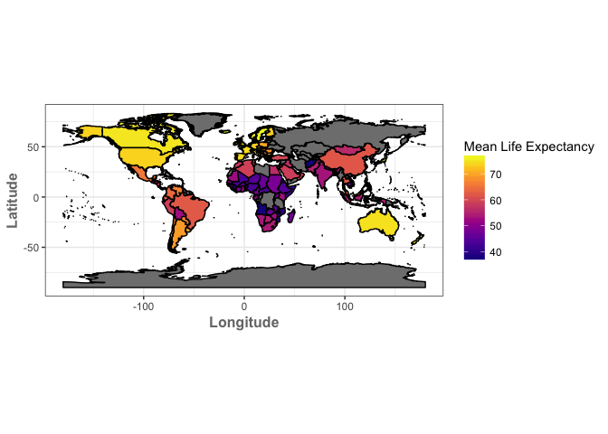
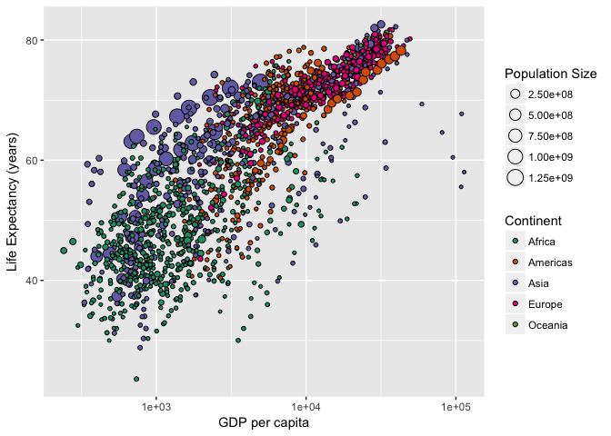

HW-05
================
Cassandra
2017-10-16

-   Load required packages

``` r
library(devtools)
library(singer)
library(forcats)
library(dplyr)
library(ggplot2)
library(tidyverse)
library(readr)
library(maptools)
library(gapminder)
library(rgeos)
library(rgdal)
library(viridis)
library(RColorBrewer)
```

Singer version:
===============

Factorise:
----------

-   I started by factorising the artist name and year attributes using the forcats factor() function.

``` r
#create copy of data in data frame
singerData <- singer_locations

# factorise year and artist name
singerData <- singerData %>%
mutate( artist_name = factor(singerData$artist_name), year = factor(singerData$year))

# confirm that they are factors
str(singerData$artist_name)
```

    ##  Factor w/ 7498 levels "'t Hof Van Commerce",..: 4458 2487 4943 5439 1897 585 7247 7393 5763 5204 ...

``` r
str(singerData$year)
```

    ##  Factor w/ 70 levels "0","1922","1926",..: 67 64 58 55 28 66 63 67 26 66 ...

Drop 0:
-------

-   I then proceeded to filter out the rows where year was equal to 0 by added only the entries where year did not equal zero to a data frame. I then used the fct\_drop() from forcats to drop unused levels. I show how the number of levels for the year factor goes from 70 to 69 once we drop the zeroes using the nlevels() function.

``` r
#Check how many levels exist before drop
nlevels(singerData$year)
```

    ## [1] 70

``` r
singerData <- singerData %>% 
  filter(year!=0)

singerData$year <- singerData$year %>%
  fct_drop()

#Check how many levels exist after drop 
nlevels(singerData$year)
```

    ## [1] 69

Reorder the levels of year, artist\_name or title
-------------------------------------------------

-   I chose to reorder the levels of year by mean artist hotttnesss in descending order. I then used the arrange function to arrange the data in the same way to confirn that the levels were in the right order. The arrange function only emporarily sorts the data but re-ordering the factor levels permanently changes the order of the levels.

``` r
singerData$year <- fct_reorder(singerData$year, singerData$artist_hotttnesss, mean, .desc = TRUE)

singerData %>%
  group_by(year) %>%
  summarize(mean_hotness=mean(artist_hotttnesss)) %>%
  arrange(desc(mean_hotness))
```

    ## # A tibble: 69 x 2
    ##      year mean_hotness
    ##    <fctr>        <dbl>
    ##  1   1954    0.5491553
    ##  2   1945    0.4688427
    ##  3   2010    0.4571736
    ##  4   1978    0.4492856
    ##  5   1967    0.4490179
    ##  6   1970    0.4473265
    ##  7   1971    0.4463278
    ##  8   1987    0.4442072
    ##  9   1981    0.4438614
    ## 10   1984    0.4427675
    ## # ... with 59 more rows

File I/O
--------

-   Here I decided to explore the use of write.csv/read.csv and saveRDS/readRDS. Based on my exploration, I noticed that the write.csv/read.csv does not save factors and their associated levels whereas saveRDS/readRDS does! I figured this out by calling the levels for the factor "year" after opening the saved data. RDS seems to save the data as a R Object instead of just a csv.

``` r
write.csv(singerData, "~/Desktop/STAT545A/singer_data.csv")
singerData_csv <-read.csv("~/Desktop/STAT545A/singer_data.csv",header=TRUE)
# call levels of year - we can see that it is not a factor and has no levels
levels(singerData_csv$year)
```

    ## NULL

``` r
saveRDS(singerData, "~/Desktop/STAT545A/singer_data.csv")
singerData_rds <-readRDS("~/Desktop/STAT545A/singer_data.csv")
# call levels of year - we can see that the levels are preserved
levels(singerData_rds$year)
```

    ##  [1] "1954" "1945" "2010" "1978" "1967" "1970" "1971" "1987" "1981" "1984"
    ## [11] "2009" "1948" "1983" "1956" "1952" "1969" "1959" "1986" "1974" "1968"
    ## [21] "1980" "1977" "1985" "2008" "1976" "1966" "1958" "1972" "1951" "1973"
    ## [31] "2003" "1988" "2007" "1979" "2004" "1999" "1962" "1975" "2000" "1989"
    ## [41] "2005" "1998" "1990" "1963" "2006" "1965" "1957" "1995" "1960" "1982"
    ## [51] "2002" "1996" "1991" "1992" "1994" "1955" "1961" "2001" "1953" "1997"
    ## [61] "1993" "1926" "1927" "1964" "1940" "1937" "1929" "1922" "1947"

Visualization design
--------------------

-   For this part of the assignment I decided to use the viridis package to colour the map that I created in a previous assignment. This map shows the mean life expectancy by country.

``` r
mle <- gapminder %>%
  group_by(country) %>%
  summarize(MeanLifeExpectancy=mean(lifeExp))

gde_15 <- readOGR("/Users/cassandrakonecny/Desktop/TM_WORLD_BORDERS-0.3", layer = "TM_WORLD_BORDERS-0.3")
```

    ## OGR data source with driver: ESRI Shapefile 
    ## Source: "/Users/cassandrakonecny/Desktop/TM_WORLD_BORDERS-0.3", layer: "TM_WORLD_BORDERS-0.3"
    ## with 246 features
    ## It has 11 fields
    ## Integer64 fields read as strings:  POP2005

``` r
gde.df <- fortify(gde_15, region="NAME")
plotData <- merge(gde.df, mle, by.x = "id", by.y = "country", all = TRUE)
plotData<-plotData[order(plotData$order), ] 
ggplot() + geom_polygon(data=plotData, aes(x=long, y=lat, group=group, fill=MeanLifeExpectancy),colour='black') +
        labs(x = 'Longitude', y = 'Latitude', fill = 'Mean Life Expectancy') +
        theme_bw() + coord_equal() +
        theme(axis.title = element_text(color="#777777", face="bold", size=12)) +
        scale_fill_viridis(option="plasma", direction = 1)
```



Writing figures to file
-----------------------

-   I saved the map locally on my computer using ggsave() and then embedded it in my report.

``` r
ggsave("lifeExp_Map.png",path = "/Users/cassandrakonecny/Desktop/STAT545A")
```

    ## Saving 7 x 5 in image


-   I also decided to bring back a plot that I made earlier showing life expectancy as a function of GDP per capita for each country coloured by continent. This time I used the RColorBrewer palettes and in addition I added a size attribute to the symbols to show population size.

``` r
ggplot(gapminder, aes(gdpPercap, lifeExp)) + 
   geom_point(aes(size=pop, fill=continent), shape=21) +
  scale_x_log10() +
  scale_fill_brewer(palette="Dark2") +
  labs(x = "GDP per capita", y = "Life Expectancy (years)", fill = 'Continent', size = "Population Size")
```


