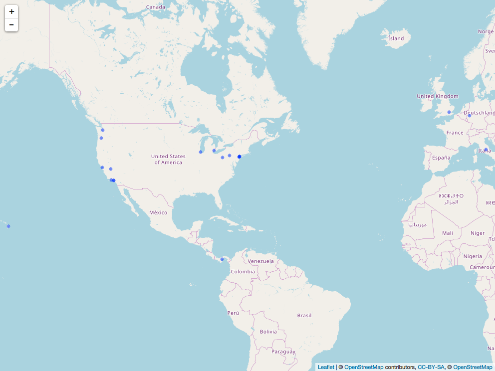
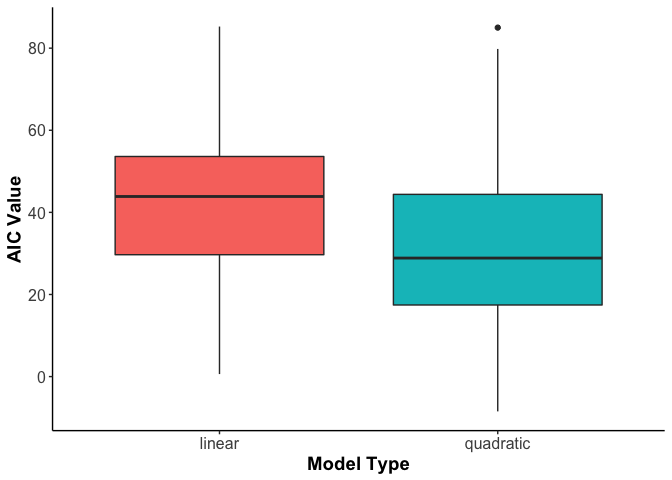

Homework 6: Data wrangling wrap up
================
Cassandra Konecny
2017-11-06

Load required packages:

``` r
library(tidyverse)
library(purrr)
library(singer)
library(ggmap)
library(leaflet)
library(htmlwidgets)
library(webshot)
library(tidyverse)
library(stringr)
library(gapminder)
library(broom)
library(reshape2)
```

Work with the singer data
=========================

Map latitude and longitude into human readable information using revgeocode()
-----------------------------------------------------------------------------

-   I could not get the map function to work with revgeocode but I am not quite sure why. I decided to instead execute the same task using the lapply function. I first filtered the data and then I created a subset to use with revgeocode. The results are displayed in a table below.

``` r
#Filter out observations with no latitude or longitude
filteredlocations <- singer_locations %>%
  filter(!is.na(latitude)) %>%
  filter(!is.na(longitude)) 

#Use subset of data for task
filteredlocations <- filteredlocations[1:20,]
  

# use lapply to pass longitude and latitude arguments into the revgeocode function
location <- do.call(rbind,
                  lapply(1:nrow(filteredlocations),
                         function(i)revgeocode(as.numeric(filteredlocations[i,12:11]))))
filteredlocations <- cbind(filteredlocations,location)

filteredlocations %>%
  select(longitude, latitude,city,location) %>%
  knitr::kable()
```

|   longitude|  latitude| city                         | location                                             |
|-----------:|---------:|:-----------------------------|:-----------------------------------------------------|
|   -87.63241|  41.88415| Chicago, IL                  | 123-135 North LaSalle Street, Chicago, IL 60602, USA |
|   -74.00712|  40.71455| New York, NY                 | 80 Chambers St, New York, NY 10007, USA              |
|   -83.04792|  42.33168| Detroit, MI                  | 2-44 Michigan Ave, Detroit, MI 48226, USA            |
|   -77.60454|  40.99471| Pennsylvania                 | 997 Sand Ridge Rd, Howard, PA 16841, USA             |
|  -119.18044|  34.20034| Oxnard, CA                   | 349 3rd Street, Oxnard, CA 93030, USA                |
|     7.10169|  50.73230| Bonn                         | An der Evangelischen Kirche 6, 53113 Bonn, Germany   |
|  -155.43414|  19.59009| Hawaii                       | Unnamed Road, Hawaii, USA                            |
|  -118.24532|  34.05349| Los Angeles, CA              | 262-298 W 1st St, Los Angeles, CA 90012, USA         |
|   -74.15400|  40.57250| Staten Island, NY            | 215 Arthur Kill Rd, Staten Island, NY 10306, USA     |
|  -122.67563|  45.51179| Portland, OR                 | Pacific Hwy W, Portland, OR 97201, USA               |
|    -0.12714|  51.50632| UK - England - London        | 18-20 Whitehall, Westminster, London SW1A, UK        |
|    12.88512|  42.50172| Poggio Bustone, Rieti, Italy | Via Roma, 24, 02018 Poggio Bustone RI, Italy         |
|   -79.99745|  40.43831| Pittsburgh, PA               | 408-414 Grant St, Pittsburgh, PA 15219, USA          |
|   -74.00712|  40.71455| New York, NY                 | 80 Chambers St, New York, NY 10007, USA              |
|  -122.42005|  37.77916| New York, NY                 | 320-398 Van Ness Ave, San Francisco, CA 94102, USA   |
|   -74.00712|  40.71455| New York, NY                 | 80 Chambers St, New York, NY 10007, USA              |
|  -118.24532|  34.05349| Los Angeles, CA              | 262-298 W 1st St, Los Angeles, CA 90012, USA         |
|  -119.27023|  37.27188| California                   | Stump Springs Rd, Lakeshore, CA 93634, USA           |
|   -80.11278|   8.41770| Panama                       | Calle Aviacion, Río Hato, Panama                     |
|  -122.23742|  47.38028| KENT, WASHINGTON             | 220-298 4th Ave S, Kent, WA 98032, USA               |

Try to check wether the place in city corresponds to the information you retrieved
----------------------------------------------------------------------------------

-   Based on the above table the city matched the retrieved information. Keep in mind this is only 30 records from the singer\_locations table however and therefore there could be error in reverse geocoding other locations.

Go visual!
----------

-   I decided to use leaflet to view the locations that I reverse geocoded. I then used the saveWidget and webshot packages to save the html and screenshot the map. This way it could be seen in a github document.

``` r
# Use leaflet to visualize the data
map <- leaflet()  %>%   
addTiles() %>%
addCircles( lat=filteredlocations$latitude,lng=filteredlocations$longitude,popup = filteredlocations$artist_name) %>%
addProviderTiles(providers$OpenStreetMap)

# Take a screenshot of map so that it can be vied it github document.
saveWidget(map,"temp.html", selfcontained = TRUE)
webshot("temp.html", file = "Rplot.png",
        cliprect = "viewport")
```



Character data
==============

In code that doesn’t use stringr, you’ll often see paste() and paste0(). What’s the difference between the two functions? What stringr function are they equivalent to? How do the functions differ in their handling of NA?
----------------------------------------------------------------------------------------------------------------------------------------------------------------------------------------------------------------------------

paste() concatenates arguments together after converting them to character strings. The function takes three inputs: One or more R objects (...), a character string to seperate terms (sep) and an optional character string to seperate the results (collapse).

paste0() works the same way as paste but is equivelent to paste(..., sep = "", collapse) and therefore can be more efficient.

These paste functions are equivalent to the str\_c() function in stringr. the syntax for this function is str\_c(..., sep = "", collapse = NULL).

The paste() and paste0() functions handle NA as a string "NA" and therefore outputs may not always be meaningful. Contrastingly, the str\_c function handles NA as true NA values.

In your own words, describe the difference between the sep and collapse arguments to str\_c().
----------------------------------------------------------------------------------------------

The seperation argument defines what character string will seperate terms that are concatenated between vectors. The collapse argument will define the string that will seperate these concatenations.

Here is an example:

``` r
# Let's say that we have vector 1 and vector 2
Vector1 <- c("a", "b","c")
Vector2 <- c("d", "e","f")
# We want to concatenate them using the str_c() function()
# Let's set sep equal to " SEP " and collapse equal to "COLLAPSE"
str_c(Vector1, Vector2, sep = " SEP ", collapse = " COLLAPSE ")
```

    ## [1] "a SEP d COLLAPSE b SEP e COLLAPSE c SEP f"

From this example we can see that the sep argument goes betweent the values that are concatenated (a&d, b&e, c&f) whereas the collapse argument goes between these groups of characters.

Use str\_length() and str\_sub() to extract the middle character from a string. What will you do if the string has an even number of characters?
------------------------------------------------------------------------------------------------------------------------------------------------

``` r
# First we need to create a string
string <- "Squid"
# Next we can use the str_length function to determine the number of characters in the string. The syntax is: str_length(string)
length <- str_length(string)
# Now that we know the length we can use the str_sub function to extract the middle character. This syntax is: str_sub(string, start = 1L, end = -1L)
# This if statements extracts the middle character if there is an odd number of characters or the middle 2 characters if there is an even number.
if (length%%2 == 0) {
   str_sub(string, start = (length/2), end = (length/2)+1)
} else {
str_sub(string, start = (length/2)+.5, end = (length/2)+.5)
}
```

    ## [1] "u"

``` r
string = "Squids"
length <- str_length(string)
if (length%%2 == 0) {
   str_sub(string, start = (length/2), end = (length/2)+1)
} else {
str_sub(string, start = (length/2)+.5, end = (length/2)+.5)
}
```

    ## [1] "ui"

What does str\_wrap() do? When might you want to use it?
--------------------------------------------------------

The str\_wrap() function takes a character string as an input and reformats it into paragraphs. In this function the user cans specify the width, indent and exdent of the paragraph. The syntax is: str\_wrap(string, width = 80, indent = 0, exdent = 0). This function would be useful for formatting long chunks of text.

Here's an example:

``` r
text <- "This chapter introduces you to string manipulation in R. You’ll learn the basics of how strings work and how to create them by hand, but the focus of this chapter will be on regular expressions, or regexps for short. Regular expressions are useful because strings usually contain unstructured or semi-structured data, and regexps are a concise language for describing patterns in strings. When you first look at a regexp, you’ll think a cat walked across your keyboard, but as your understanding improves they will soon start to make sense."

#Let's use a width of 80 with no indent or exdent
cat(str_wrap(text, width = 80, indent = 0, exdent = 0),"\n")
```

    ## This chapter introduces you to string manipulation in R. You’ll learn the
    ## basics of how strings work and how to create them by hand, but the focus of
    ## this chapter will be on regular expressions, or regexps for short. Regular
    ## expressions are useful because strings usually contain unstructured or semi-
    ## structured data, and regexps are a concise language for describing patterns in
    ## strings. When you first look at a regexp, you’ll think a cat walked across your
    ## keyboard, but as your understanding improves they will soon start to make sense.

``` r
# Now let's make the width 30 and set the indent to 2
cat(str_wrap(text, width = 30, indent = 2, exdent = 0),"\n")
```

    ##   This chapter introduces
    ## you to string manipulation
    ## in R. You’ll learn the
    ## basics of how strings work
    ## and how to create them by
    ## hand, but the focus of this
    ## chapter will be on regular
    ## expressions, or regexps for
    ## short. Regular expressions
    ## are useful because strings
    ## usually contain unstructured
    ## or semi-structured data, and
    ## regexps are a concise language
    ## for describing patterns
    ## in strings. When you first
    ## look at a regexp, you’ll
    ## think a cat walked across
    ## your keyboard, but as your
    ## understanding improves they
    ## will soon start to make sense.

What does str\_trim() do? What’s the opposite of str\_trim()?
-------------------------------------------------------------

str\_trim() removes whitespace from a character vector. This can be from the left right or both the left and right. You could use string pad with pad = " " to add whitespace.

Work with a nested data frame
=============================

-   For this exercise I followed the example given in the [split-apply-combine](http://stat545.com/block024_group-nest-split-map.html#general-approach-nesting) lesson from class and modified where I saw fit.

Nest the data by country (and continent)
----------------------------------------

``` r
nested.gapminder <- gapminder %>% 
   group_by(continent, country) %>% 
   nest()
```

Fit a model of life expectancy against year. Possibly quadratic, possibly robust (see above prompt re: function writing).
-------------------------------------------------------------------------------------------------------------------------

-   I decided here to create both a linear and quadratic model function.

``` r
linear_lifeExpModel <- function(df) {
  lm(lifeExp ~ I(year - 1950) , data = df)
}
quadratic_lifeExpModel <- function(df) {
  lm(lifeExp ~ I(year - 1950) + I((year - 1950)^2), data = df)
}
```

Use functions for working with fitted models or the broom package to get information out of your linear models.
---------------------------------------------------------------------------------------------------------------

-   I tried out the map() function here to make sure that I was able to run the linear model on the nested data.

``` r
map(nested.gapminder$data[1:2], linear_lifeExpModel)
```

    ## [[1]]
    ## 
    ## Call:
    ## lm(formula = lifeExp ~ I(year - 1950), data = df)
    ## 
    ## Coefficients:
    ##    (Intercept)  I(year - 1950)  
    ##        29.3566          0.2753  
    ## 
    ## 
    ## [[2]]
    ## 
    ## Call:
    ## lm(formula = lifeExp ~ I(year - 1950), data = df)
    ## 
    ## Coefficients:
    ##    (Intercept)  I(year - 1950)  
    ##        58.5598          0.3347

Use the usual dplyr, tidyr, and ggplot2 workflows to explore, e.g., the estimated cofficients.
----------------------------------------------------------------------------------------------

-   I created a new data frame with the linear model data.

``` r
unnested.gapminder <- nested.gapminder %>% 
  mutate(linear_fit = map(data, linear_lifeExpModel), 
         linear_tidy = map(linear_fit, tidy)
         ) %>%
  select(continent, country, linear_tidy) %>% 
  unnest(linear_tidy) 

head(unnested.gapminder) %>%
  knitr::kable()
```

| continent | country     | term           |    estimate|  std.error|  statistic|  p.value|
|:----------|:------------|:---------------|-----------:|----------:|----------:|--------:|
| Asia      | Afghanistan | (Intercept)    |  29.3566375|  0.6989813|   41.99918|  0.0e+00|
| Asia      | Afghanistan | I(year - 1950) |   0.2753287|  0.0204509|   13.46289|  1.0e-07|
| Europe    | Albania     | (Intercept)    |  58.5597618|  1.1335758|   51.65933|  0.0e+00|
| Europe    | Albania     | I(year - 1950) |   0.3346832|  0.0331664|   10.09104|  1.5e-06|
| Africa    | Algeria     | (Intercept)    |  42.2364149|  0.7562690|   55.84840|  0.0e+00|
| Africa    | Algeria     | I(year - 1950) |   0.5692797|  0.0221271|   25.72775|  0.0e+00|

-   Next I modified the functions to return AIC values for the model.

``` r
linear_Model <- function(df) {
  lm(lifeExp ~ I(year - 1950) , data = df) %>%
  AIC()
}
quad_Model <- function(df) {
  lm(lifeExp ~ I(year - 1950) + I((year - 1950)^2), data = df) %>%
  AIC()
}
```

-   I then ran the linear and quadratic model functions to get the AIC values for both models for each country.

``` r
AIC.gapminder <- nested.gapminder %>% 
  mutate(linear_fit = map(data, linear_Model), 
         linear_tidy = map(linear_fit, tidy),
         quad_fit = map(data, quad_Model), 
         quad_tidy = map(quad_fit, tidy)
         ) %>%
  select(continent, country, linear_tidy, quad_tidy) %>% 
  unnest(linear_tidy, quad_tidy) %>%
  rename(linear = x, quadratic = x1)

head(AIC.gapminder) %>%
  knitr::kable()
```

| continent | country     |     linear|  quadratic|
|:----------|:------------|----------:|----------:|
| Asia      | Afghanistan |  42.693870|   25.76083|
| Europe    | Albania     |  54.298071|   46.16921|
| Africa    | Algeria     |  44.584427|   39.06301|
| Africa    | Angola      |  46.061857|   28.16086|
| Americas  | Argentina   |   8.347866|   10.29841|
| Oceania   | Australia   |  26.417353|   16.11008|

-   Finally I compared the AIC values for the linear and quadratic models across all countries in a boxplot. From this we can see that the quadratic model generally has lower AIC values.

``` r
AIC.gapminder <- AIC.gapminder %>%
  melt(type=c('linear','quadratic'))
```

    ## Using continent, country as id variables

``` r
ggplot(AIC.gapminder, aes(variable, value)) + 
  geom_boxplot(aes(fill= variable)) + 
  theme_classic() +
  labs(x="Model Type", y= "AIC Value") +
  theme(axis.text=element_text(size=12),
  axis.title=element_text(size=14,face="bold")) +
  theme(legend.position="none")
```


