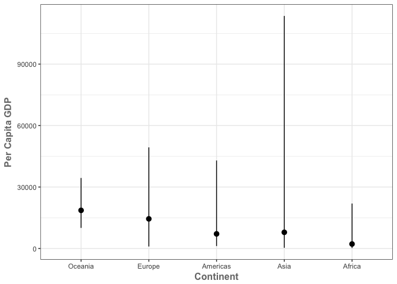
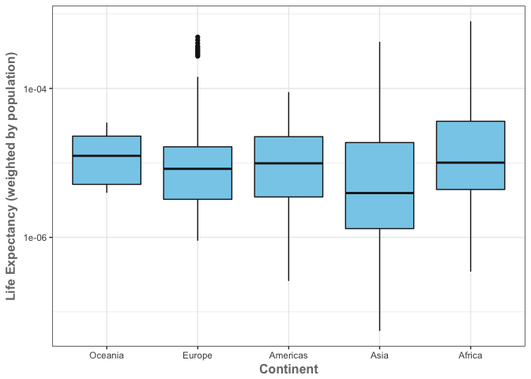
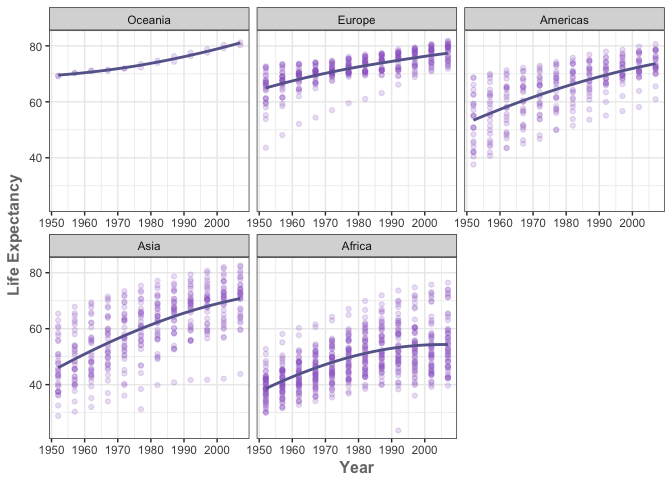

Homework 7: Automating Data-analysis Pipelines
================
Cassandra
2017-11-15

Download the data
=================

-   Load required packages

``` r
library(downloader)
library(dplyr)
library(forcats)
library(ggplot2)
```

-   Download Data and bring the data in as data frame

``` r
download(url = "https://raw.githubusercontent.com/jennybc/gapminder/master/inst/extdata/gapminder.tsv", destfile = "gapminder.tsv")
gapminderData<-read.delim("gapminder.tsv")
```

Perform exploratory analyses
============================

-   Reorder the continents based on life expectancy. You decide the details.

``` r
levels(gapminderData$continent)
```

    ## [1] "Africa"   "Americas" "Asia"     "Europe"   "Oceania"

``` r
#reorder data by lifeExp in descending order
gapminderData$continent <- fct_reorder(gapminderData$continent, gapminderData$lifeExp, mean, .desc = TRUE)
levels(gapminderData$continent)
```

    ## [1] "Oceania"  "Europe"   "Americas" "Asia"     "Africa"

-   Sort the actual data in a deliberate fashion. You decide the details, but this should at least implement your new continent ordering.

``` r
dapminderData <- gapminderData %>%
  arrange(country,year)
```

-   Save a couple descriptive plots to file with highly informative names.

``` r
p1 <- gapminderData %>%
ggplot() + 
  stat_summary(
    mapping = aes(x = continent, y = gdpPercap),
    fun.ymin = min,
    fun.ymax = max,
    fun.y = mean)+
    theme_bw() +
    theme(axis.title = element_text(color="#777777", face="bold", size=12)) + 
    labs(y = 'Per Capita GDP', x = 'Continent') 
ggsave("gdpPerCap_by_continent.png", p1)
```

    ## Saving 7 x 5 in image

``` r
p2 <- gapminderData %>%
mutate(lifeExp_pop = (lifeExp/pop)) %>%
ggplot(aes(x=continent, y=lifeExp_pop)) + geom_boxplot(colour="gray10", fill="skyblue") +
scale_y_log10() +  labs(x = 'Continent', y = 'Life Expectancy (weighted by population)') +
theme_bw() +
theme(axis.title = element_text(color="#777777", face="bold", size=12))
ggsave("lifeExp_popWeighted_by_continent.png", p2)
```

    ## Saving 7 x 5 in image

``` r
p3 <- gapminderData %>%
ggplot(aes(year, lifeExp)) +
    labs(x = 'Year', y = 'Life Expectancy') +
    facet_wrap(~ continent,scales="free_x") +
    geom_point(colour="#9966CC", alpha=0.2) + geom_smooth(span=2, colour="#666699", se=FALSE)+
    theme_bw() +
    theme(axis.title = element_text(color="#777777", face="bold", size=12))
ggsave("lifeExp_country_facet_by_continent.png", p3)
```

    ## Saving 7 x 5 in image

    ## `geom_smooth()` using method = 'loess'

``` r
p1
```



``` r
p2
```



``` r
p3
```

    ## `geom_smooth()` using method = 'loess'



-   Write the Gapminder data to file(s), for immediate and future reuse.

``` r
# write data to file
write.table(gapminderData, "gapminder_reordered.tsv", quote = FALSE,
            sep = "\t", row.names = FALSE)
```

Import the data created in the first script. Make sure your new continent order is still in force. You decide the details. Fit a linear regression of life expectancy on year within each country. Write the estimated intercepts, slopes, and residual error variance (or sd) to file. The R package broom may be useful here. Find the 3 or 4 “worst” and “best” countries for each continent. You decide the details.
